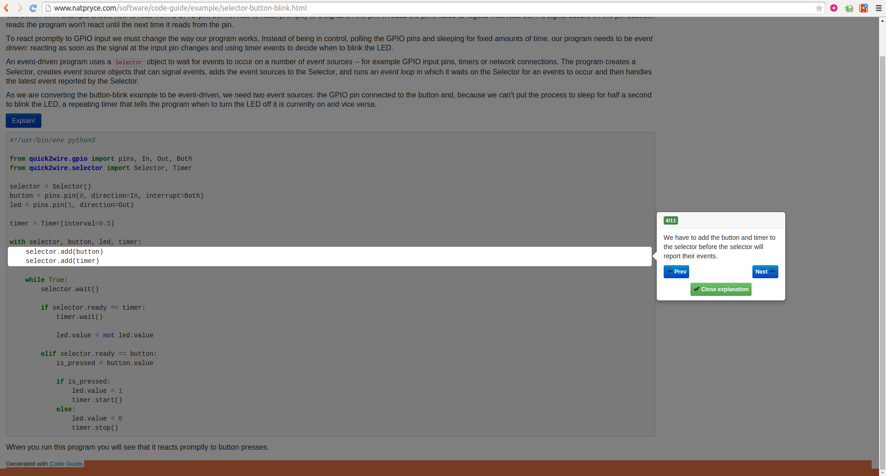
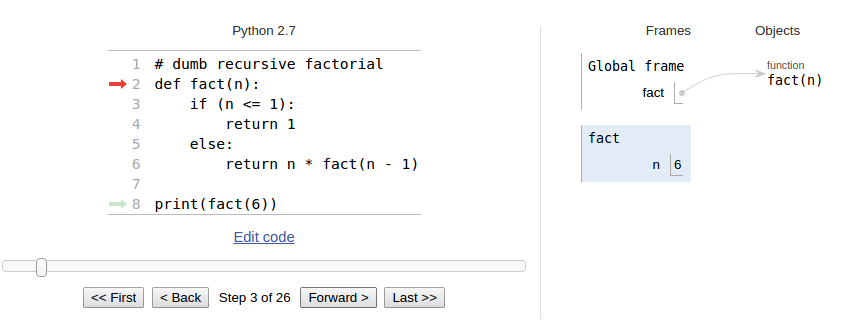

#Existing solutions
We've researched some of the existing solutions for interactive code documentation, interactive storytelling and algorithm visualization. This chapter lists some notable examples. 

##[code-guide](http://www.natpryce.com/software/code-guide/example/selector-button-blink.html)

Code guide is a solution to generate interactive documentation from python files. It works by writing a string of documentation and linking it to one or more lines of code. When the interactive documentation is started, the lines of code for which documentation is available are highlighted in sequence and it's documentation is shown in a text bubble. Highlighting the relevant code is a useful visual element. 

##[Python  Tutor](http://www.pythontutor.com/)
Python tutor is a tool that explains the execution of a python script. It does ths by stepping through the code like a debugger and showing the state of the program on the right. It shows fairly low level animations with no possibility to be extended. This tool allows for exploring the code by stepping through it's execution, however it doesn't allow the writer to add a personalized output. 

##Existing documentation frameworks
There are many tools for adding for generating documentation for code. A few examples are [Doxygen](http://www.stack.nl/~dimitri/doxygen/), [JSDoc](http://www.lsauer.com/2013/05/javascript-documentation-generator.html) and [Sphinx](http://sphinx-doc.org/). 
These documentation tools commonly scan the code to generate a documentation. However, after the documents are generated there's no further interaction with the project. 

###Notes
http://www.academia.edu/265331/Algorithm_Explorer_Visualizing_Algorithms_In_a_3D_Multimedia_Environment

Inspiration: http://bost.ocks.org/mike/algorithms/

